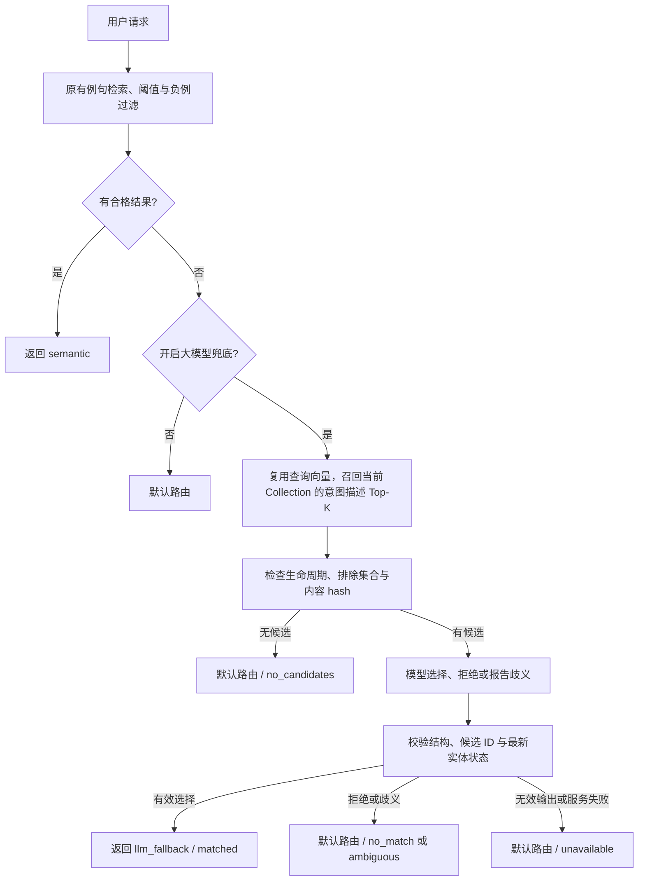

# 未命中路由的大模型兜底：需求与交付记录

本文于 **2026-09-10 根据本次执行记录补写**，将需求、设计、实现、测试和本地运行记录集中留存。它不是事前审批记录；历史结果和本次重新验证分开标注。接口、架构与操作细节分别以 [API](../../API.md)、[架构说明](../../ARCHITECTURE.md) 和 [使用指南](../../../USER_GUIDE.md) 为准。

## 文档补写时的交付状态

下表记录文档补写时的快照；后续代码与文档的提交、推送状态以 Git 历史及远端分支为准。提交仓库不代表生产部署。

| 内容 | 状态与证据边界 |
| --- | --- |
| 功能实现 | 已实现后端兜底、描述向量同步、设置与测试页展示；工作区尚未提交或推送 |
| 程序验证 | 本次重新运行后端测试：84 passed；前端类型检查及构建通过 |
| 本地运行 | 2026-09-10 16:17:54 +08:00 检查时，前后端可访问，Embedding 与 Qdrant 健康；独立演示 Collection 有 36 个向量点 |
| 外部 LLM 鉴权 | 初次排查出现 HTTP 401；本次代理和直连的 `GET /models` 均恢复为 200 |
| 真实模型效果 | **待重新验证**。本次没有重跑生成请求；模型列表可访问不证明分类用例通过 |
| 生产部署 | 未执行。本次启动的是本地 Flask / Vite 演示实例 |

## 需求来源与范围

用户先提出：最终路由未匹配任何意图实体时，用 RAG 从所有意图实体名称和描述的向量中选择最合适的实体；随后要求按 `ai-native-dev` 推进、在新 Collection 中创建测试数据并启动项目，以及排查 API 调用失败。最后要求补齐过程文档并加强 Skill 的文档交付要求。

目标是补回例句覆盖不足导致的长尾漏匹配，同时保留原有路由约束。这里的“所有意图”指**当前选定 Collection 对应、有效且已同步的意图**，不是跨 Collection 搜索。新增 Collection 用于隔离演示数据；功能本身复用当前 Collection。

以下属于本次实现采用的工程取舍，不表述为用户逐条审批：

- 现有路由已经命中时直接返回，不追加模型调用。
- 未命中时先召回 Top-K，再由模型判断职责是否适用；允许拒绝和歧义，不强制挑选一个实体。
- 保留负例排除、生命周期与同步一致性约束，模型不能绕过它们。
- 默认关闭，复用既有 LLM 连接配置；错误时回到原有默认路由。
- 本次不实现多轮澄清、跨 Collection 检索、模型训练或生产发布。效果、成本和延迟须通过后续真实样本评估。

## 设计与关键契约



1. **复用元数据点。** 每个意图的 Qdrant 恢复元数据点已有完整实体 payload，新增名称与描述向量及 `description_hash`。普通例句检索仍排除 `is_route_metadata=true`。这样避免维护第二套 Collection 和额外的实体映射；旧零向量无 hash，不参与兜底，增量同步负责补齐。
2. **召回与判别分工。** 检索用名称、描述；模型接收候选的 ID、名称、描述以及最多各三条例句和负例。向量相似仅代表相关性，模型依据职责边界判别。模型只能返回候选 ID，不能创造实体。
3. **保持同步一致性。** 召回后校验描述 hash 与 route hash，调用前保存候选深拷贝，返回前重读实体，防止调用期间编辑、禁用或删除的实体被返回。过期候选可能使可用数量少于 Top-K；当前不继续补召回。
4. **失败可区分。** `matched`、`no_match`、`ambiguous` 是模型决策；`no_candidates` 表示没有可用候选或选择已失效；`unavailable` 表示新增兜底阶段异常，包括无效输出和超时。原有 Embedding / 例句检索故障仍走原接口错误机制。
5. **客户端与请求同生命周期。** Flask 各次调用通过 `asyncio.run` 使用各自的事件循环；缓存的异步 HTTP 连接不能跨已关闭的循环复用。兜底对使用此 HTTP 传输的 provider 在请求内创建并关闭 `httpx.AsyncClient`，防止连续请求出现连接／事件循环错误；Gemini 保持自身 SDK 路径。

`POST /predict` 保持列表响应，增加 `match_source` 和 `fallback_status`。例句匹配的 `score` 仍是原相似度；模型选择与默认路由的 `score=null`，不把模型自评置信度当相似度。`ambiguous` 供调用方提示补充信息，本次不会自动启动多轮对话。

配置默认值为 `LLM_FALLBACK_ENABLED=false`、`LLM_FALLBACK_TOP_K=5`、`LLM_FALLBACK_TIMEOUT_SECONDS=8`。兜底温度固定为 0、SDK 重试为 0。超时控制模型调用，不是整个 `/predict` 的总延迟上限；前置 Embedding、向量检索和初始化仍消耗时间。

## 实现入口

| 模块 | 职责 |
| --- | --- |
| [prediction_service.py](../../../intent-hub-backend/intent_hub/services/prediction_service.py) | 未命中分支进入兜底，传递查询向量及负例排除集合 |
| [fallback_service.py](../../../intent-hub-backend/intent_hub/services/fallback_service.py) | 候选筛选、受约束的模型输出、超时和降级、并发修改复核 |
| [intent_description.py](../../../intent-hub-backend/intent_hub/intent_description.py)、[qdrant_wrapper.py](../../../intent-hub-backend/intent_hub/qdrant_wrapper.py) | 描述文本与 hash、元数据向量写入和检索 |
| [sync_service.py](../../../intent-hub-backend/intent_hub/services/sync_service.py)、[sync_task_service.py](../../../intent-hub-backend/intent_hub/services/sync_task_service.py) | 补齐旧向量、复用未变描述向量、后台状态写入保留向量 |
| [models.py](../../../intent-hub-backend/intent_hub/models.py)、[config.py](../../../intent-hub-backend/intent_hub/config.py)、[settings.py](../../../intent-hub-backend/intent_hub/api/settings.py)、[llm_factory.py](../../../intent-hub-backend/intent_hub/services/llm_factory.py) | 响应契约、开关与参数校验、模型构造参数 |
| [Settings.vue](../../../intent-hub-frontend/src/views/Settings.vue)、[AgentTest.vue](../../../intent-hub-frontend/src/views/AgentTest.vue) | 配置项与来源／降级状态展示，以 `match_source` 识别默认结果 |

## 验收与程序验证

下表函数均来自 [test_llm_fallback.py](../../../intent-hub-backend/tests/test_llm_fallback.py)。这些测试验证程序契约，不代表真实模型已经学会正确拒绝或消歧。

| 验收场景 | 可观察结果 | 对应测试函数 |
| --- | --- | --- |
| 未命中或例句搜索为空 | 召回描述并返回验证后的实体，查询只编码一次 | `test_unmatched_retrieves_definitions_and_returns_validated_entity`、`test_empty_utterance_search_also_uses_fallback` |
| 功能关闭或原有命中 | 不调用 LLM | `test_disabled_or_existing_match_never_calls_llm` |
| 拒绝、歧义、非法 JSON／ID、provider 异常 | 返回默认实体并区分状态 | `test_abstention_and_invalid_outputs_keep_default` |
| 负例、禁用、删除、旧向量或过期内容 | 不进入模型候选；排除发生在 Top-K 之前 | `test_ineligible_candidates_never_reach_model`、`test_negative_exclusion_survives_fallback`、`test_description_lookup_filters_exclusions_before_top_k` |
| 模型调用期间实体修改 | 不返回失效实体，原地编辑不污染快照 | `test_route_changed_during_model_call_is_not_returned`、`test_in_place_edit_during_model_call_uses_immutable_candidate_snapshot` |
| 模型超时 | 取消请求并保留默认结果 | `test_model_deadline_cancels_request_and_preserves_default` |
| 同步升级与后台完成 | 补齐旧向量，未变内容复用；写失败／版本变化不误报成功 | `test_description_sync_backfills_legacy_and_reuses_unchanged_vectors`、`test_background_task_preserves_description_vector`、`test_metadata_write_failure_does_not_acknowledge_sync`、`test_version_change_during_embedding_is_not_acknowledged` |
| 接口鉴权及设置校验 | 预测保持鉴权；非法配置先拒绝，不修改内存或文件 | `test_http_predict_returns_fallback_contract_and_requires_auth`、`test_settings_api_saves_fallback_controls_and_rejects_bad_values`、`test_invalid_settings_rejected_before_any_mutation` |
| 连续真实 SDK 调用 | 三次独立事件循环可完成本地 HTTP 请求 | `test_consecutive_real_sdk_calls_work_across_request_event_loops` |

本次文档补齐期间重新执行：

```powershell
# 仓库根目录；输出到新的本地文件，避免覆盖本记录的历史证据
python -m pytest intent-hub-backend/tests -q --junitxml=.tmp/llm-fallback-recheck.xml
# intent-hub-frontend 目录
npm run build
```

实际留存结果：后端 **84 passed，3 warnings**，控制台耗时 97.77 秒；JUnit suite 时间为 90.422 秒，统计口径不同。警告来自既有 Pydantic `.dict()` 弃用。前端 `vue-tsc` 与 Vite 构建成功，保留大于 500 KB 的 chunk 提示。本次没有因文档工作改动产品代码来消除既有警告。

测试主要使用模拟编码器、内存 Qdrant 和模拟模型；连续 SDK 用例使用真实 SDK 连接本地 HTTP stub，验证传输生命周期，未访问远端模型。界面截图同样来自隔离模拟场景，不能作为真实分类成功证据。

## 真实服务记录与 API 故障

首次六条真实请求见 [原始结果](evidence/live-cases-initial.json)，它们发生在本次文档整理前、异步传输修复前，使用当时的 `deepseek-chat` 配置。该结果文件没有逐条时间戳，不能据此恢复精确执行时刻。

| 用例 | 预期 | 首次实际结果 | 是否通过 |
| --- | --- | --- | --- |
| 正常例句匹配 | `semantic` / `demo.order.track` | `semantic`，score 1.0 | 是 |
| 长尾表达触发兜底 | `llm_fallback` / `demo.invoice.issue` | `default` / `unavailable` | 否 |
| 职责边界拒绝 | `default` / `no_match` | `default` / `unavailable` | 否 |
| 歧义需要澄清 | `default` / `ambiguous` | `default` / `unavailable` | 否 |
| 域外请求拒绝 | `default` / `no_match` | `default` / `unavailable` | 否 |
| 负例排除不可绕过 | `default` / `no_match` | `default` / `unavailable` | 否 |

首次请求包含冷启动，单次耗时约 6.2–28.5 秒；这组样本用于功能演示，不是性能基准或准确率报告。五条 `unavailable` 证明失败时保留了默认路由，**不证明模型正确拒绝了请求**。

此前排查识别到两类问题：请求间复用异步传输的代码问题，以及当时 DeepSeek 凭据的 HTTP 401。前者已有修复及连续 SDK 回归测试；后者属于当时服务鉴权状态。历史 401 根据本次执行记录整理，未将含请求细节的完整诊断日志复制到正式文档。

**2026-09-10 16:17:54 +08:00 重新检查**时，当前 `deepseek-flash` 配置通过代理和直连访问 `GET /models` 都返回 200，可见 `deepseek-flash`、`deepseek-v4-pro`，详见 [鉴权快照](evidence/api-auth-diagnosis.json)。本次没有重新调用生成接口，因此不能把初次失败表改为通过，也不能继续把 401 写成当前故障。恢复后的下一步是用当前配置重跑六条预测并保留新的带时间戳结果。

## 本地部署与复现

### 已启动实例

- 前端：<http://127.0.0.1:5173>；后端：<http://127.0.0.1:5000>。
- 独立 Collection：`llm_fallback_demo_20260910_152741`。
- 本机运行目录：`D:\code\intent-hub\.tmp\llm-fallback-demo-20260910-152741`，保存独立配置、路由、进程记录与日志；其中凭据不纳入文档。
- 演示开关启用、Top-K 5、模型调用超时 20 秒。六个意图共 18 条正例、12 条负例和 6 个描述元数据点，合计 36 点，实际向量维度 2560。
- 例句阈值 0.99 用于方便触发兜底，**不是推荐生产值**。配置中的 `BAAI/bge-m3` 仅为元数据名称，没有独立核实远端实际模型身份。
- 原始 `bupt_test` 及原工作区三份数据未被演示流程覆盖；[运行快照](evidence/runtime-snapshot.json) 中原始 `settings.json`、`routes.json`、`diagnostics_cache.json` 完整性检查均为 true。它们原本就有工作区修改，不代表相对 Git 干净。

当前实例需要重启时，可在确认 5000 端口没有旧实例后，从仓库根目录执行：

```powershell
python .tmp/llm-fallback-demo-20260910-152741/manage.py serve
```

不要再次执行当前实例的 `setup`，也不要用旧备份覆盖已更新的模型凭据。此 `manage.py` 是当前实例的临时辅助文件；下面保留不依赖它的重建方法。

### 从正式示例重建隔离演示

前提：安装后端依赖（[requirements.txt](../../../intent-hub-backend/requirements.txt)）与前端依赖（[package-lock.json](../../../intent-hub-frontend/package-lock.json)），原工作区已具备有效配置；Qdrant、Embedding 和 LLM 可访问。以下是按当前代码整理的复现步骤，**本次未另外创建第二个远端 Collection 逐步重跑**。

1. 在仓库根目录创建新的本地隔离目录，例如 `.tmp/llm-fallback-review`。只把 `intent-hub-backend/data/settings.json` 复制进去，在副本中设置全新的 `QDRANT_COLLECTION`，如 `llm_fallback_review_<时间戳>`，并将 `AGENT_API_URL`、`AGENT_API_TOKEN` 设为 `null`。保留 `AUTH_ENABLED=true`，在副本配置演示登录信息和独立 `PREDICT_AUTH_KEY`；检查 LLM、Embedding、Qdrant 的有效连接配置。不要复制原 routes 或后台任务文件。
2. 将下列启动器保存为隔离目录中的 `serve.py`。它在应用初始化前指向隔离数据目录；运行时只启动这一份后端。

```python
import sys
from pathlib import Path

runtime = Path(__file__).resolve().parent
root = runtime.parents[1]  # 仓库/.tmp/llm-fallback-review
sys.path.insert(0, str(root / "intent-hub-backend"))
from intent_hub.config import Config

assert (runtime / "settings.json").is_file(), "先准备隔离配置副本"
Config.SETTINGS_FILE_PATH = str(runtime / "settings.json")
Config.load()
Config.DATA_DIR = runtime
Config.ROUTES_CONFIG_PATH = str(runtime / "routes.json")
Config.DIAGNOSTICS_CACHE_PATH = str(runtime / "diagnostics_cache.json")
Config.SYNC_TASKS_PATH = str(runtime / "sync_tasks.json")
Config.FLASK_HOST = "127.0.0.1"
Config.FLASK_PORT = 5000
Config.FLASK_DEBUG = False
from intent_hub.app import init_app

init_app().run(host="127.0.0.1", port=5000, debug=False, use_reloader=False)
```

3. 在根目录运行 `python .tmp/llm-fallback-review/serve.py`。另一个 PowerShell 在 `intent-hub-frontend` 中运行 `npm run dev -- --host 127.0.0.1 --port 5173 --strictPort`；Vite 默认将 `/api` 代理到 5000，已有 `VITE_API_BASE_URL` 时检查它是否仍指向本地后端。
4. 登录管理台，在设置页新建并选中上述全新 Collection。将 [演示数据](../../examples/llm-fallback-demo.json) 的 `routes` 数组作为 `{"routes": [...], "mode": "merge"}` 导入（管理台导入或 `POST /routes/import`，使用登录后的管理凭据）。文件的 `cases` 是测试预期，不是实体。等待六个意图均同步成功，核对 36 个向量点；同步行为参见使用指南。
5. 配置并开启兜底，设置 Top-K 5、超时 20 秒，在测试页依次输入示例中的六个 `cases[].text`，比对 `expected_source`、`expected_route_key` 或 `expected_status`。也可使用独立 `PREDICT_AUTH_KEY` 调用 `POST /predict`。记录实际响应、配置、时间及耗时，不用仅检查 HTTP 200 代替业务断言。

### 检查、停机与恢复

先检查前端可访问、`GET /health` 为 ok，再登录检查 `GET /health/services` 的 Embedding 与 Qdrant 状态，最后执行一条普通命中和一条真实兜底预测。健康检查不覆盖模型分类效果。

前台实例用所在终端的 Ctrl+C 停止。当前后台实例的 `backend.pid`、`frontend.pid` 只提供线索：停止前通过端口监听和进程命令行确认仍是本次项目进程，避免 PID 被重用后误停其他程序。本文不固化 PID。

功能回退可在对应实例设置中关闭 `LLM_FALLBACK_ENABLED`，无需删除描述向量或清空 Collection；默认分支继续可用。恢复原工作区时先停止隔离实例，再按项目启动方式使用原配置启动，不把演示数据复制回原目录。保留演示 Collection 与配置供复核；删除远端数据不属于本次文档补齐动作。

## 证据目录与追溯

| 证据 | 来源与适用范围 |
| --- | --- |
| [backend-pytest.txt](evidence/backend-pytest.txt)、[backend-pytest.xml](evidence/backend-pytest.xml) | 本次重新运行的后端完整测试；JUnit 起始时间 `2026-09-10T16:16:15.219037+08:00`；XML 仅移除机器 hostname 属性，结果不变 |
| [frontend-build.txt](evidence/frontend-build.txt) | 本次重新运行的前端构建控制台结果；构建工具输出不含精确开始时间 |
| [source-version.json](evidence/source-version.json) | 本次受测源码、测试、依赖清单与示例的 SHA256，以及基础提交；工作区未提交，不能仅用基础提交定位实现 |
| [runtime-snapshot.json](evidence/runtime-snapshot.json) | 本次只读健康、Collection 与数据完整性检查；仅保留必要配置，无真实密钥 |
| [api-auth-diagnosis.json](evidence/api-auth-diagnosis.json) | 本次模型列表鉴权检查，无生成请求 |
| [live-cases-initial.json](evidence/live-cases-initial.json) | 原样复制自当前演示运行目录的 `check-results.json`；首次历史结果，未覆盖为新结果 |
| [ui-matched-offline.png](evidence/ui-matched-offline.png)、[ui-ambiguous-offline.png](evidence/ui-ambiguous-offline.png) | 分别复制自 `.tmp/fallback-ui-match.png`、`.tmp/fallback-ui-ambiguous.png`；历史隔离 UI 模拟模型截图，未据此声称远端模型成功 |

仓库既有说明曾列出 `python -m scripts.api_docs check`，但当前树不存在对应模块，因此没有把该检查记为通过。本次改用相关接口测试及文档链接／内容检查；不新增无关文档生成工具。

## 未完成的效果与发布验证

- 使用当前可鉴权模型重新执行六条真实预测，分别确认长尾命中、边界拒绝、域外拒绝、歧义和负例约束；API 失败与模型误判分开统计。
- 扩展有标注的业务样本，比较开启前后的正确补回、误接、拒绝与歧义比例，并记录检索候选覆盖率、请求成本、冷启动和稳定运行时延。当前六条受控用例不足以证明收益或选择生产阈值。
- 如后续部署到生产，再按目标环境验证依赖地址、鉴权、描述向量同步、开关回退和端到端用户路径。本记录没有生产发布结论。
